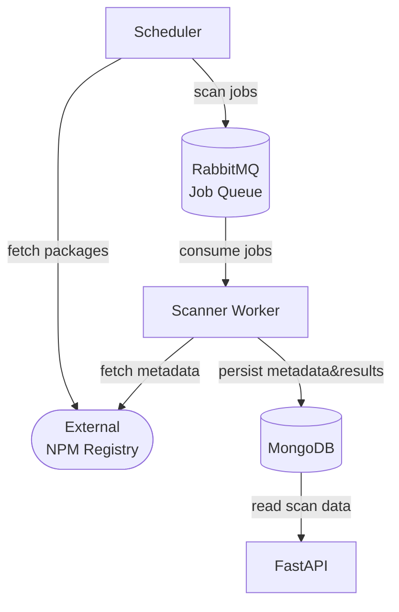
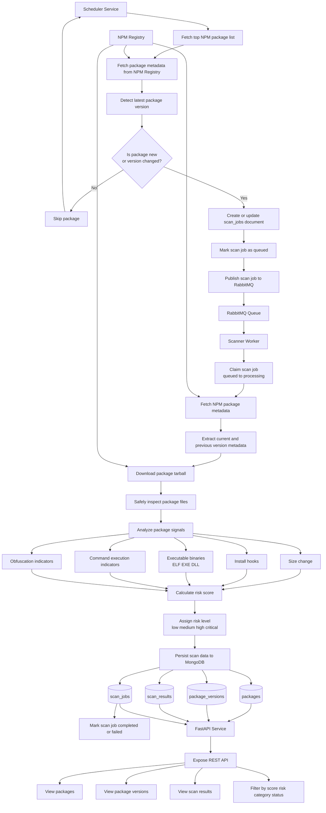
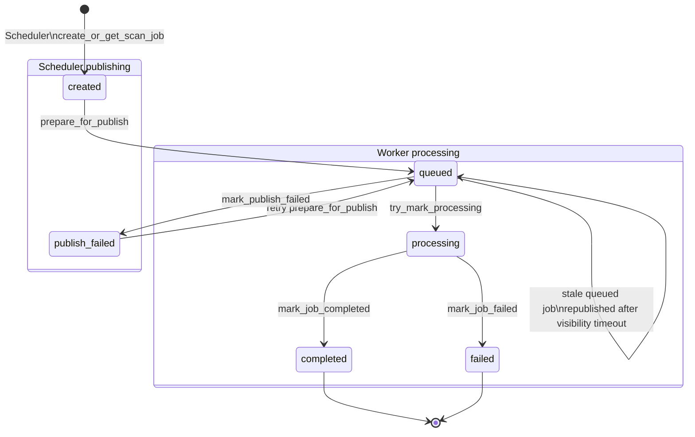

# Intelligence Scanner

This project provides a comprehensive solution for scanning and analyzing intelligence data. It includes a scheduler for managing tasks, a worker for executing scans, and an API for interacting with the system.

## Overview

#### API 
- Exposes package scan results and jobs status.

#### Scheduler 
 - continuously monitors packages (every 8 hours). 
 - fetches package list from npm registry.
 - for each package queries NPM registry metadata and latest version.
 - compares with stored latest known version if exists.
 - publishes scan job to RabbitMQ if package is new or version changed.

#### Scanner-worker
* Consumes scan jobs from RabbitMQ.
* For each package/version, it should:
  1. Fetch NPM registry metadata
  2. Save relevant metadata:
       - package name
       - latest version
       - upload date
       - package size
       - dependencies
       - scripts
       - tarball URL
       - maintainers
       - license
       - repository
       - previous version metadata 
  3. Download package tarball
  4. Extract files safely
  5. Analyze:
       - size change from previous version
       - install hooks (e.g. preinstall, install, postinstall)
       - executable binaries (e.g. ELF, PE/EXE, DLL)
       - obfuscation indicators
       - command execution indicators
  6. Calculate malware-risk score
  7. Store scan result in MongoDB

#### MongoDB
- Packages, scaner job results persistent storage.

#### RabbitMQ
- Message broker for job distribution.

## Architecture

### High-level overview


### Detailed Scan Flow


### Scan job status transitions


## Data model

Check for detailed MongoDB schema [here](src/intelligence_scanner/db/schemas.py).

- `packages` collection. Stores the latest known state of each package.
- `package_versions` collection. Stores metadata per package version.
- `scan_results` collection. Stores each analysis result.
- `scan_jobs` collection. Stores scheduled job metadata.

## Scoring model & Risk levels

- Additive scoring model starts with score `1` capped at `100`. The scanner does not claim to prove that a package is malicious. 
Instead, it produces a risk score based on suspicious behavioral indicators commonly seen in supply-chain attacks: 
  - install-time execution, 
  - native binaries, 
  - command execution, 
  - suspicious size deltas,
  - obfuscation. 
- This is important. A package with a `postinstall` script may be legitimate, but it increases risk.

| Risk level                          | Score threshold |
|-------------------------------------|-----------------|
| `low`                               | 1-20            |
| `medium`                            | 21-50           |
| `high`                              | 51-80           |
| `critical`                          | 81-100          |

| Signal                               | Condition                                 | Score impact |
|--------------------------------------|-------------------------------------------|--------------|
| Size increase                        | `> 50%`                                   | +5           |
| Size increase                        | `> 100%`                                  | +10          |
| Size increase                        | `> 300%`                                  | +20          |
| Size decrease                        | `> 70%`                                   | +5           |
| `preinstall` added                   | current has it, previous did not          | +30          |
| `install` added                      | current has it, previous did not          | +25          |
| `postinstall` added                  | current has it, previous did not          | +30          |
| install hook exists in both versions | current and previous both have it         | +10          |
| install hook removed                 | previous had it, current does not         | +3           |
| executable binary found              | ELF/EXE/DLL                               | +25          |
| multiple binaries found              | more than 3                               | +15          |
| command execution pattern            | `child_process`, `exec`, `spawn`, etc.    | +20          |
| suspicious shell command             | `curl`, `wget`, `chmod`, `bash`, etc.     | +15          |
| obfuscation indicator                | `eval`, `Function(...)`, encoded payloads | +20          |
| scan files limit exceeded            | more than 100 files scanned               | +10          |


## Setup & Installation

### Docker
The application runs in a Docker Compose environment:

1. Ensure Docker and Docker Compose are installed.
2. Create necessary environment file:
   - `.env` for shared configuration (look at `.env.example` for reference)
3. Build the images:
   ```bash
   make build
   ```
4. Run all the services:
   ```bash
   make up
   ```

The API service will be available at http://localhost:8000. Also, please check the OpenAPI documentation at http://localhost:8000/docs.
   
### Local
1. Ensure [**uv**](https://docs.astral.sh/uv/) is installed for dependency management.
2. Install all dependencies:
   ```bash
   make install
   ```
3. Then run services locally with:
    ```bash
   uv run python -m intelligence_scanner.services.scheduler.main
   uv run python -m intelligence_scanner.services.scanner.worker
   uv run uvicorn intelligence_scanner.services.api.main:app --host 0.0.0.0 --port 8000
   ```
   But you still need MongoDB and RabbitMQ running, for example:
   ```bash
   docker compose up -d mongodb rabbitmq
   ```